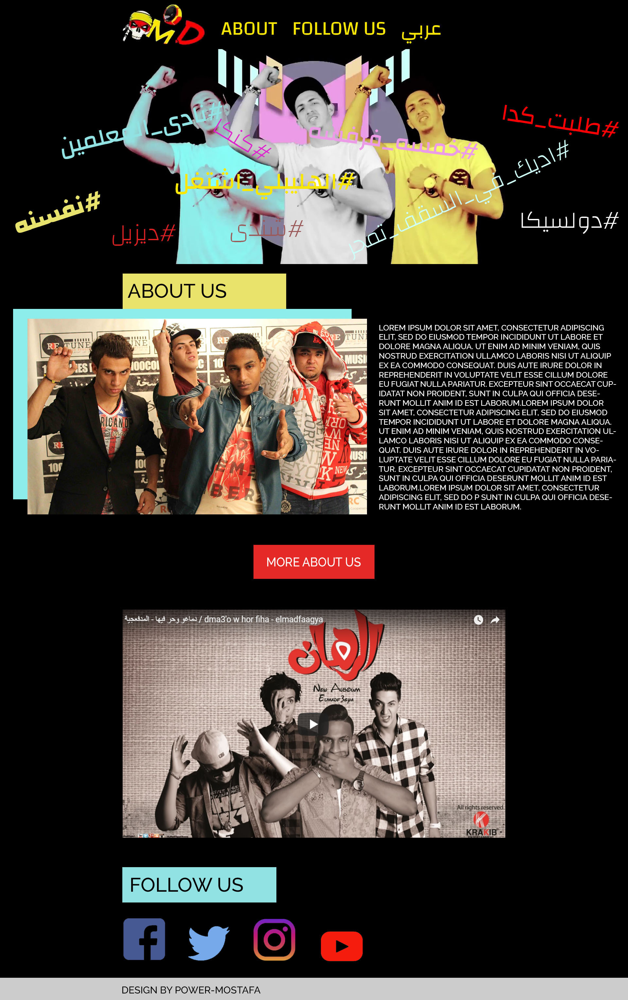

# Bander (HTML Musical Band Template)

HTML musical band template , one of my first projects


For Live Preview : https://bander-html-musical-band-template.netlify.app/

## Quickstart

1. Install the [node.js](https://nodejs.org/en/)
2. Clone the project

    ```bash
    git clone https://Power50015/Bander-HTML-Musical-Band-Template.git
    ```

3. Go to project folder and run

    ```bash
    npm install
    ```

4. Start development mode

    ```bash
    npm run gulp:dev
    ```

5. In browser open page with address [http://localhost:3000/](http://localhost:3000/)

### Main tasks

- npm run gulp:dev -  launches watchers and server & compile project.
- npm run gulp:build - optimize & minify files for production version.

## Template Features:

- HTML5, CSS3
- Fully Responsive
- Easy to Customizable
- W3C Validated Code
- Minimal and Clean
- Free Google Fonts.
- All files are well commented

## What do you get?

- HTML Content
- CSS Sheets
- Gulp Files

## Fonts:

- Google Fonts

## Plugins:

- Normalize.css
- NPM & Gulp
- No CSS or JS Framework included

## Support:

- If you need any help using the file or need special customizing please contact me via my Github or my Website.
- If you like my html template, please follwo me , We’ll appreciate it very much Thank you.
